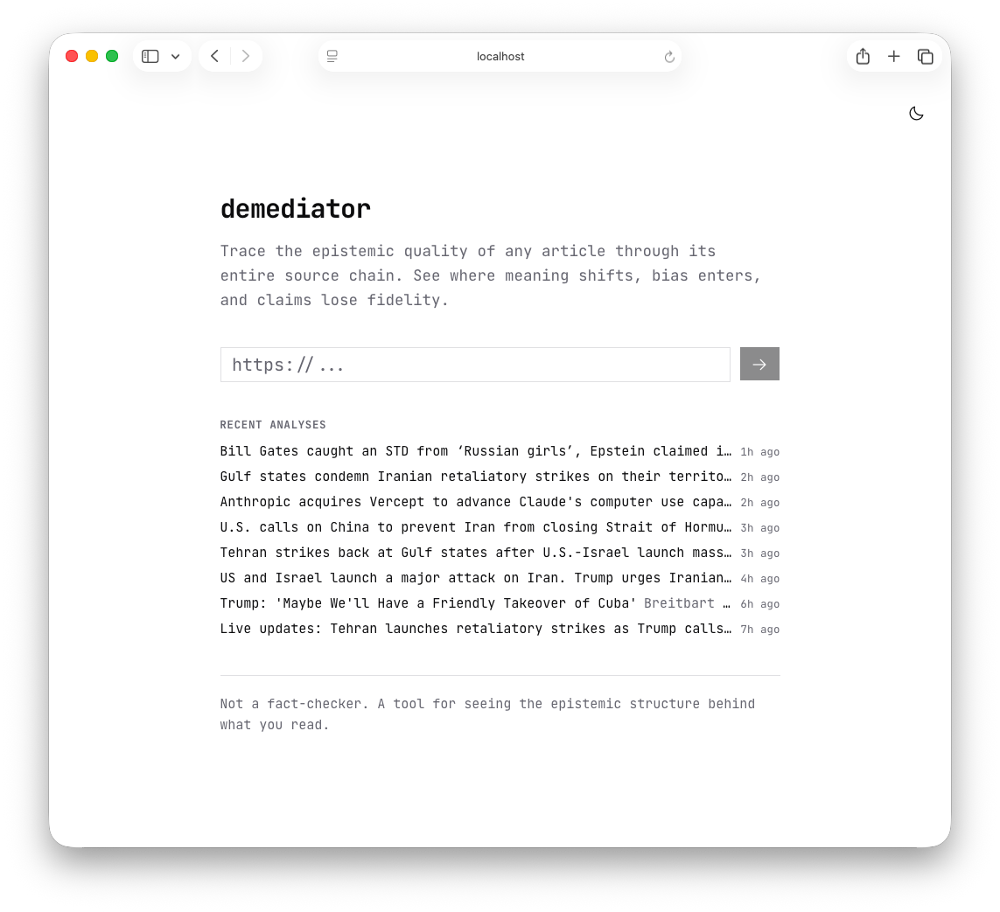
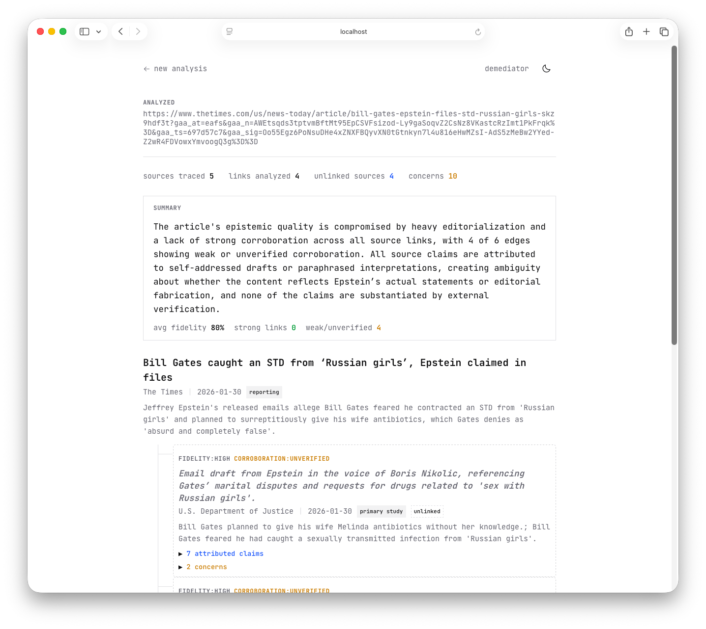

# demediator

Trace epistemic quality through the news source chain. Paste a URL, and demediator crawls the article's sources recursively, analyzing how claims mutate as they pass from primary sources through layers of reporting.

> **Status:** Early development. The core pipeline works but the project is not yet packaged for easy deployment.

## Screenshots

| Landing page | Analysis results |
|:---:|:---:|
|  |  |

## What it does

1. **Scrapes** the target article and extracts cited sources (linked and unlinked)
2. **Recursively crawls** the source chain up to 5 levels deep (BFS)
3. **Classifies** each source (primary study, wire service, press release, opinion, etc.)
4. **Extracts claims** and builds a knowledge graph of entities and relationships
5. **Analyzes fidelity** between each source pair — how faithfully does the downstream article represent what the source actually said?
6. **Identifies editorialization** — where spin gets added between source and reporting
7. **Detects unsubstantiated claims** — assertions with no traceable source
8. **Renders a source tree** showing the full chain with per-edge metrics

## Architecture

```
┌──────────────┐     ┌───────────┐     ┌──────────────┐
│   Next.js    │────▸│  Crawl4AI │     │  LLM (small) │
│   Frontend   │     │  Scraper  │     │  classify,    │
│              │     └───────────┘     │  extract,     │
│  /results    │                       │  match,       │
│  source tree │     ┌───────────┐     │  summarize    │
│              │────▸│ PostgreSQL│     └──────────────┘
│  /api/analyze│     │ + pgvector│     ┌──────────────┐
└──────────────┘     └───────────┘     │  LLM (large) │
                                       │  fidelity     │
                                       │  analysis     │
                                       └──────────────┘
                                       ┌──────────────┐
                                       │  Embedding    │
                                       │  model        │
                                       └──────────────┘
```

### External services

demediator connects to three categories of external services, all configurable via environment variables:

#### Crawl4AI (web scraper)

The scraper service handles URL fetching, JavaScript rendering, and markdown extraction. demediator expects a [Crawl4AI](https://github.com/unclecode/crawl4ai) instance (or any API-compatible alternative) running on port 11235 by default.

Crawl4AI uses Playwright under the hood, so it handles SPAs, paywalled previews, and dynamically-loaded content. demediator calls two endpoints:

- `/crawl` — returns raw HTML, internal/external links, and page metadata
- `/md` — returns cleaned article markdown with boilerplate stripped

Results are cached in-memory (process lifetime) and on disk (24-hour TTL in `.cache/scraper/`).

```bash
# Run Crawl4AI with Docker
docker run -p 11235:11235 unclecode/crawl4ai
```

#### LLMs (OpenAI-compatible API)

demediator uses **three separate LLM endpoints**, all speaking the OpenAI chat completions API. This means any OpenAI-compatible server works: [vLLM](https://github.com/vllm-project/vllm), [Ollama](https://ollama.com), [llama.cpp](https://github.com/ggml-org/llama.cpp), [LiteLLM](https://github.com/BerriAI/litellm), or OpenAI itself.

| Endpoint | Purpose | Suggested model class |
|----------|---------|----------------------|
| **Small LLM** (port 8001) | Classification, claim extraction, phantom matching, summaries | 7-14B instruction-tuned (e.g., Qwen 2.5 7B, Llama 3.1 8B) |
| **Large LLM** (port 8003) | Source fidelity analysis (comparing two documents) | 32B+ reasoning model (e.g., Qwen 2.5 32B, Llama 3.1 70B) |
| **Embedding** (port 8002) | Claim similarity for cross-source corroboration | Any model producing 768-dim vectors |

All three can point to the same server if you prefer — just set the env vars accordingly. The separation exists because fidelity analysis benefits from a larger model while classification/extraction can run fast on a smaller one.

**JSON mode is required** — the models must support `response_format: { type: "json_object" }`. Most OpenAI-compatible servers support this.

#### PostgreSQL + pgvector

Analysis results are persisted in PostgreSQL with the [pgvector](https://github.com/pgvector/pgvector) extension for claim embeddings (768-dimensional vectors). The schema is managed by [Drizzle ORM](https://orm.drizzle.team/).

```bash
# Create the database
createdb demediator

# Enable pgvector (requires the extension installed)
psql demediator -c "CREATE EXTENSION IF NOT EXISTS vector;"

# Apply the schema
pnpm db:push
```

## Setup

### Prerequisites

- Node.js 20+
- pnpm
- PostgreSQL 15+ with pgvector
- A Crawl4AI instance
- One or more OpenAI-compatible LLM endpoints

### Install and run

```bash
git clone https://github.com/nicosxt/demediator.git
cd demediator
pnpm install

# Configure services
cp .env.example .env.local
# Edit .env.local with your endpoints

# Set up database
pnpm db:push

# Run dev server
pnpm dev
```

Open `http://localhost:3000`, paste a news article URL, and submit.

## Environment variables

See [`.env.example`](.env.example) for the full list. Key variables:

| Variable | Required | Description |
|----------|----------|-------------|
| `DATABASE_URL` | Yes | PostgreSQL connection string |
| `SCRAPER_BASE_URL` | Yes | Crawl4AI endpoint (default: `http://localhost:11235`) |
| `SMALL_LLM_BASE_URL` | Yes | OpenAI-compatible endpoint for fast tasks |
| `SMALL_LLM_MODEL` | Yes | Model name for the small LLM |
| `LARGE_LLM_BASE_URL` | Yes | OpenAI-compatible endpoint for fidelity analysis |
| `LARGE_LLM_MODEL` | Yes | Model name for the large LLM |
| `EMBEDDING_BASE_URL` | Yes | OpenAI-compatible embedding endpoint |
| `EMBEDDING_MODEL` | Yes | Embedding model name |

## Tech stack

- **Framework:** Next.js 16 + React 19 + TypeScript
- **Database:** PostgreSQL + Drizzle ORM + pgvector
- **Scraping:** Crawl4AI (external service)
- **LLM:** OpenAI-compatible API (any provider)
- **UI:** Tailwind CSS + shadcn/ui + Radix UI + Phosphor Icons

## License

[MIT](LICENSE)
